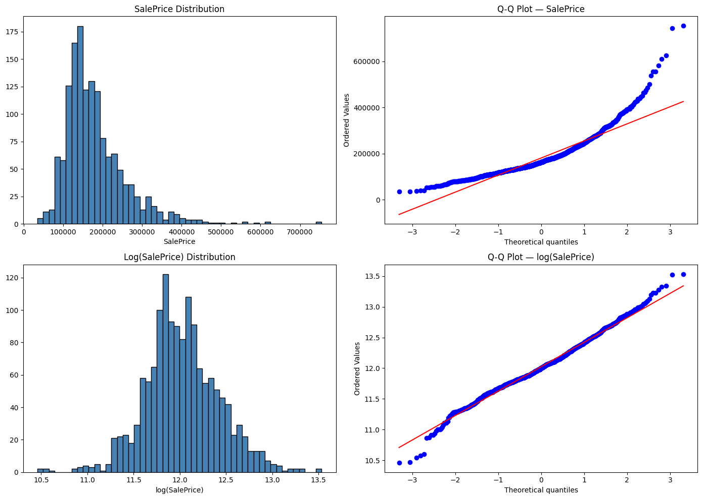
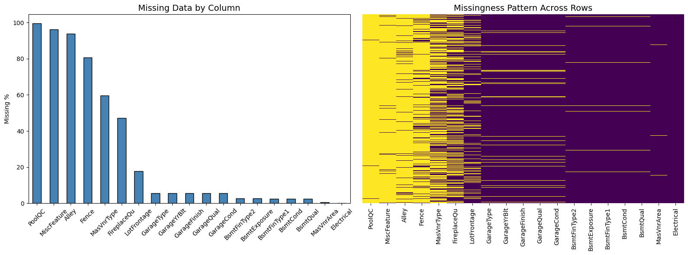
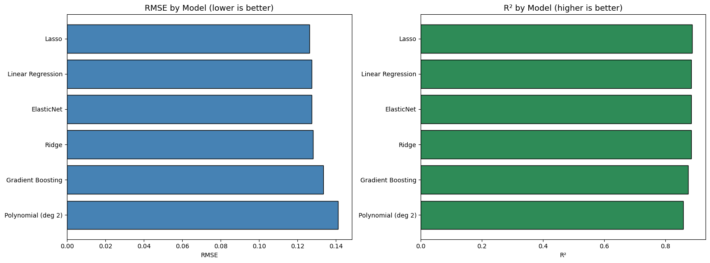
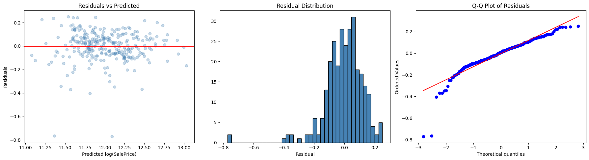
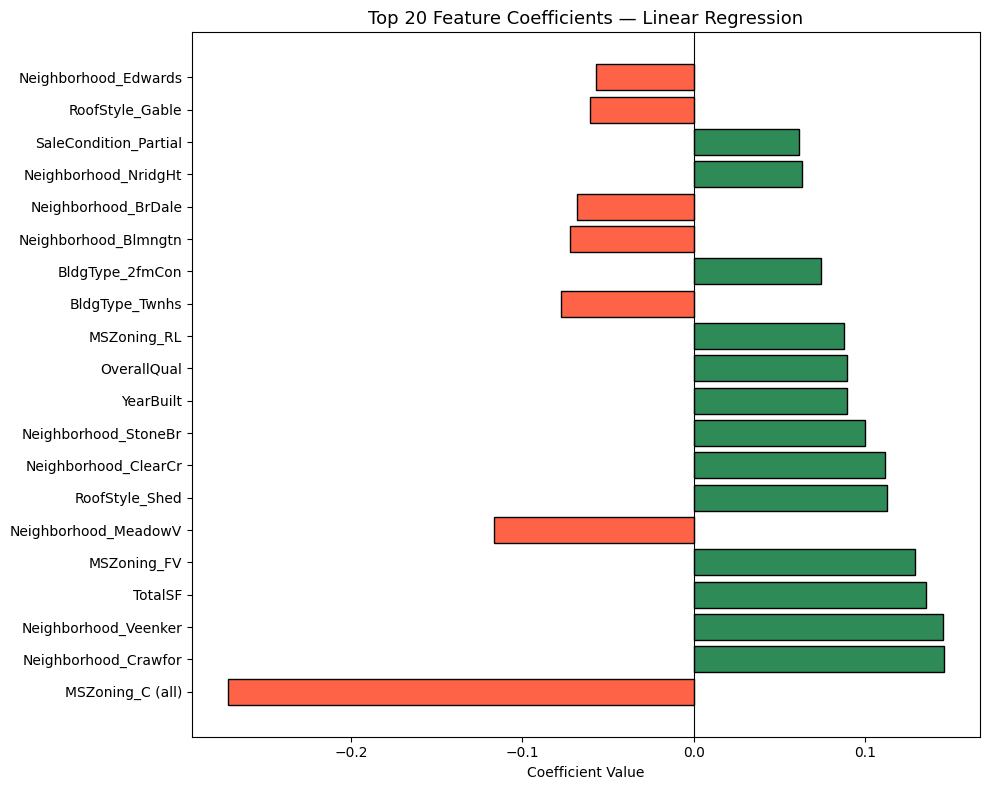

# Regression Suite — Ames Housing Price Prediction


End-to-end machine learning regression pipeline built on the Ames Housing dataset 
(Kaggle: House Prices - Advanced Regression Techniques). Covers the full workflow 
from exploratory data analysis to model evaluation and interpretation.

---

## Project Highlights

* **End-to-End Regression Pipeline:** Fully integrated workflow from raw data ingestion to model deployment.
* **Domain-Driven Feature Engineering:** Creation of 7 semantic features (e.g., TotalSF, HouseAge) to maximize signal.
* **Leakage-Safe Preprocessing:** Complete isolation of training statistics using scikit-learn's `Pipeline` and `ColumnTransformer`.
* **Cross-Validated Evaluation:** Rigid comparison of 6 regression models using 5-fold cross-validation for stability.
* **Interpretability & Diagnostics:** Feature coefficient analysis and residual diagnostics to verify assumptions.
* **Production-Ready Design:** Clear path forward for FastAPI integration, Docker containerization, and MLOps tooling.

---

## Project Structure

```text
regression-suite/
├── LICENSE                      # MIT License
├── housing_analysis.ipynb       # Main notebook — EDA to model evaluation
├── best_model_pipeline.joblib   # Saved best model pipeline
├── train.csv                    # Dataset (Kaggle)
├── requirements.txt             # Dependencies
├── README.md                    # This file
└── screenshots/                 # Visual outputs
    ├── target_distribution.png
    ├── missing_data.png
    ├── model_comparison.png
    ├── residuals_analysis.png
    └── feature_coefficients.png
```

---

## Dataset

- **Source**: [Kaggle — House Prices: Advanced Regression Techniques](https://www.kaggle.com/competitions/house-prices-advanced-regression-techniques)
- **Size**: 1,460 rows, 81 columns
- **Target**: SalePrice (residential home sale price in Ames, Iowa)
- **Features**: Numeric and categorical — covering lot size, neighborhood, construction quality, basement, garage, and more.

---

## Quick Start

```bash
git clone https://github.com/Rehanku/regression-suite.git
cd regression-suite
pip install -r requirements.txt
jupyter notebook housing_analysis.ipynb
```
*Note: The dataset (`train.csv`) is not included in the repo. Download it from Kaggle and place it in the project root.*

---

## Prediction Example

Below is a clean Python snippet demonstrating how to load the serialized best-performing pipeline and run inference on a new, unseen house sample:

```python
import joblib
import pandas as pd
import numpy as np

# 1. Load the serialized best model pipeline (preprocessor + Ridge model)
pipeline = joblib.load('best_model_pipeline.joblib')

# 2. Define a new sample property matching the model's required inputs
sample_house = {
    'OverallQual': 7,
    'TotalSF': 2200.0,
    'GrLivArea': 1600.0,
    'GarageCars': 2,
    'TotalBsmtSF': 950.0,
    'FullBath': 2,
    'YearBuilt': 2005,
    'HouseAge': 21,
    'RemodAge': 21,
    'HasGarage': 1,
    'HasBsmt': 1,
    'Has2ndFloor': 1,
    'Neighborhood': 'CollgCr',
    'MSZoning': 'RL',
    'SaleCondition': 'Normal',
    'BldgType': '1Fam',
    'HouseStyle': '2Story',
    'RoofStyle': 'Gable'
}

# 3. Convert dictionary to pandas DataFrame
sample_df = pd.DataFrame([sample_house])

# 4. Predict log-transformed price
log_prediction = pipeline.predict(sample_df)[0]

# 5. Convert prediction back to original scale (SalePrice in USD)
predicted_price = np.exp(log_prediction)

print(f"Predicted Sale Price: ${predicted_price:,.2f}")
```

---

## Key Visuals

### Target Variable Distribution


### Missing Data Pattern


### Model Comparison (Test R² & RMSE)


### Residual Analysis


### Feature Coefficients (Top 20)


---

## Workflow

### 1. Exploratory Data Analysis
* Shape, dtypes, and statistical summary across all 81 columns.
* Missing data analysis — 19 columns with missing values identified and visualized.
* Target variable distribution — SalePrice confirmed right-skewed (skewness = 1.88).
* Log transformation applied to normalize target (post-transform skewness = 0.12).
* Correlation analysis across all numeric features.
* Multicollinearity check — redundant features removed based on inter-feature correlation threshold of 0.7.
* Outlier detection using IQR — 31 outliers removed from GrLivArea.

### 2. Feature Engineering
Created 7 domain-driven features from existing columns:

| Feature | Formula | Rationale |
|---|---|---|
| **TotalSF** | TotalBsmtSF + 1stFlrSF + 2ndFlrSF | Total living area across all floors |
| **HouseAge** | YrSold - YearBuilt | Age of house at time of sale |
| **RemodAge** | YrSold - YearRemodAdd | Years since last remodel |
| **HasPool** | PoolArea > 0 | Binary presence flag |
| **HasGarage** | GarageArea > 0 | Binary presence flag |
| **Has2ndFloor** | 2ndFlrSF > 0 | Binary presence flag |
| **HasBsmt** | TotalBsmtSF > 0 | Binary presence flag |

### 3. Preprocessing Pipeline
Built using scikit-learn `ColumnTransformer` + `Pipeline`:
* **Numeric features (12):** Median imputation → StandardScaler
* **Categorical features (6):** Mode imputation → OneHotEncoder
* *No data leakage — all transformations learned on training set only.*

---

## Reproducibility

To ensure complete reproducibility of the analysis and model outputs:

* **Consistent Random State:** A seed of `random_state = 42` is strictly enforced across all data splits and randomized estimators.
* **Rigid Data Split:** Models are trained and evaluated on an 80/20 train-test split.
* **Leakage Prevention:** All preprocessing transformers are `fit` only on the training set, preventing any data leakage into the test set.
* **Pipeline-Based Workflow:** Both preprocessing and models are bound inside scikit-learn `Pipeline` and `ColumnTransformer` constructs.
* **Log-Transformed Target:** The target variable (`SalePrice`) is log-transformed during training to stabilize variance and normalize errors.

---

## Models Compared

| Model | MAE | RMSE | R² |
|---|---|---|---|
| Lasso | 0.0911 | 0.1263 | 0.8872 |
| Linear Regression | 0.0920 | 0.1273 | 0.8854 |
| ElasticNet | 0.0909 | 0.1275 | 0.8851 |
| Ridge | 0.0912 | 0.1280 | 0.8841 |
| Gradient Boosting | 0.0934 | 0.1335 | 0.8740 |
| Polynomial (deg 2) | 0.0987 | 0.1411 | 0.8591 |

*\*Metrics reported on log(SalePrice). All models trained on 80/20 train-test split.*

### Cross-Validation Results (5-Fold)

| Model | CV R² Mean | CV R² Std |
|---|---|---|
| **Ridge (Best)** | **0.8757** | **0.0122** |
| ElasticNet | 0.8756 | 0.0125 |
| Lasso | 0.8751 | 0.0147 |
| Linear Regression | 0.8728 | 0.0149 |
| Gradient Boosting | 0.8637 | 0.0121 |
| Polynomial (deg 2) | 0.8454 | 0.0229 |

*Selected based on highest mean CV R² and lowest standard deviation among top performers, indicating both strong performance and stability across folds.*

---

## Residual Analysis
* Residuals show random scatter around zero — no systematic bias detected.
* Residual distribution approximately normal.
* Minor heteroscedasticity at higher predicted values — expected given the 18-feature model does not capture all price drivers for luxury properties.

---

## Key Insights
> "A house’s overall quality rating alone can explain ~67% of its price variation. After controlling for size and neighbourhood, a pool adds almost no value in Ames, Iowa. Regularized linear models outperform more complex ones — the relationships are largely linear after proper feature engineering."

* Overall quality rating is the single strongest predictor of sale price (r = 0.82).
* Total square footage across all floors outperforms individual floor area features.
* Neighborhood and zoning contribute meaningful signal beyond numeric features.
* Houses with no basement or garage sell at a significant discount even after controlling for size.
* Regularized linear models (Ridge, Lasso, ElasticNet) outperform Polynomial and Gradient Boosting on this dataset.

---

## Tech Stack
* Python 3.x
* pandas, numpy, scipy
* scikit-learn
* matplotlib, seaborn
* joblib

---

## Roadmap (Phase 2)
- [ ] Refactor preprocessing, training, and evaluation logic into modular `src/` components during the API deployment phase
- [ ] FastAPI prediction endpoint (`POST /predict`)
- [ ] Docker containerization
- [ ] MLflow experiment tracking
- [ ] GitHub Actions CI/CD pipeline

---

## Author
**Rehan Khan** [GitHub Profile](https://github.com/Rehanku)